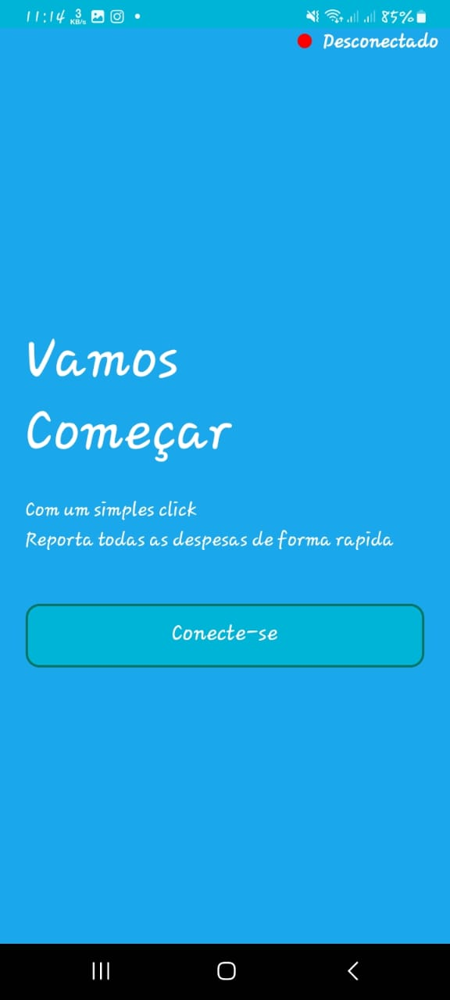
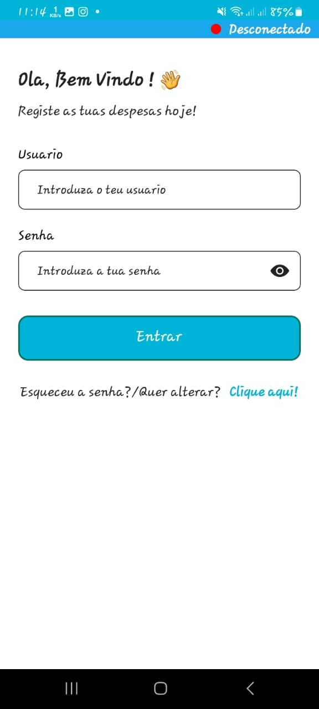
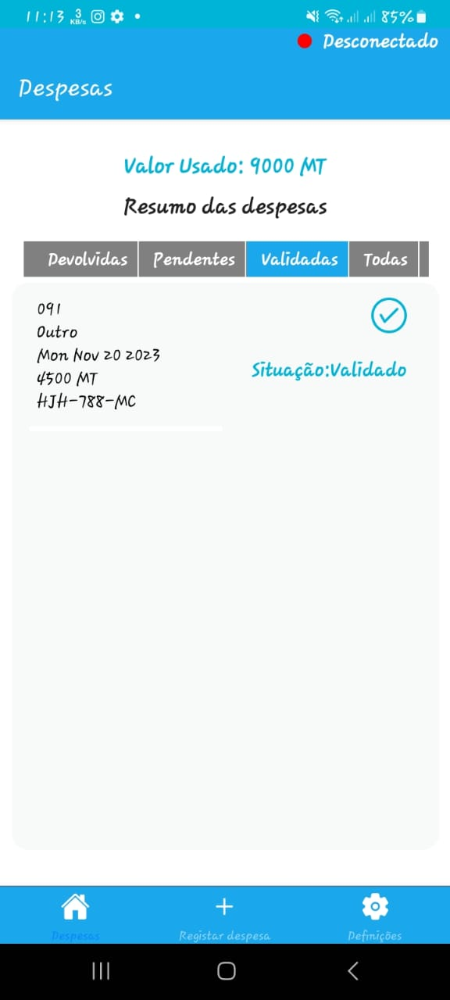
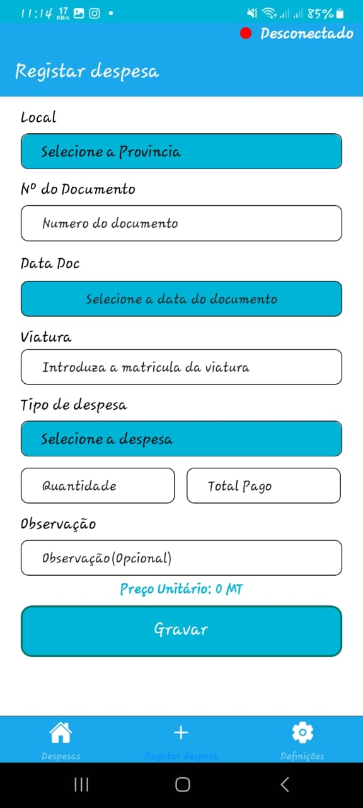

# Aplicação movel de Gestão de Despesas

Uma aplicação android para controle de despesas e gastos dentro de uma organização ou empresa.

## Indice

- <a href="#-funcionalidades">Funcionalidades</a>
- <a href="#-layput">Layout</a>
- <a href="#-instalar">Como Instalar<a>
- <a href="#-tecnologias">Tecnlogias utilizadas</a>
- <a href="#-autores">Pessoas autoras</a>
- <a href="#-futuro">Proximos passos</a>

## Funcionalidades da Aplicação
- [x] Registar Despesas
- [x] Editar Despesas Desvolvida
- [x] Listar todas Despesas
- [x] Recuperar/Alterar a senha

## 👁‍🗨 Layout

## Como rodar este projeto?

### Clone este repositorio
$ git clone https://github.com/ArsenioLanga/DispensasMobileApp.git

### Acesse a pasta do projecto no teu terminal
$ git cd DespesasApp

### Instale as dependências
$ npm install

### Execute a aplicação
$ npm start
    
##  Tecnologias
A aplicação foi desenvolvida usando a framework  React Native da linguagem javascript, e para o gereciamento dos dados usou o Realtime Database e Cloud Storage do firebase.
1. [React NATIVE] (https://reactnative.dev/)
2. [Firebase] (https://firebase.google.com/)

## Pessoas Autoras
A aplicação foi desenvolvida pelo <strong>Arsénio Langa</strong> com todos os direitos cedidos a <strong>serviSIS Moçambique</strong> 

## Proximos Passos
Desenvolver uma versão para IOS e publicar na Play Store e App Store 